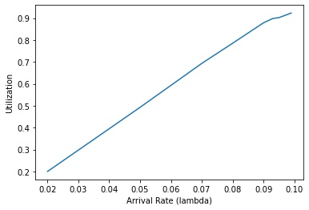
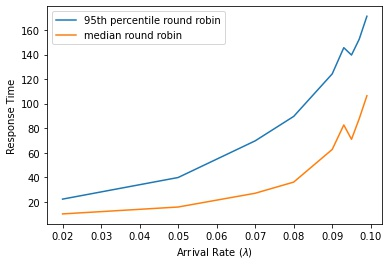
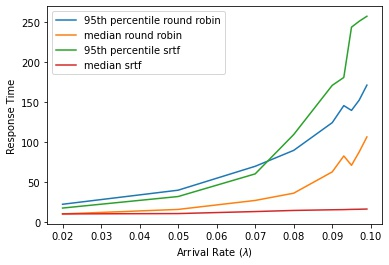

<div dir="rtl">

تمرین گروهی ۲ - زمان‌بندی
======================

شماره گروه: ۷
-----

> نام و آدرس پست الکترونیکی اعضای گروه را در این قسمت بنویسید.

سروش شرافت sorousherafat@gmail.com

علی‌پاشا منتصری alipasha.montaseri@gmail.com

کیان بهادری  kkibian@gmail.com

مهدی علیزاده alizademhdi@gmail.com

##  تغییرات طراحی

### ساعت زنگ‌دار بهینه

در این بخش در طراحی خود تغییری ایجاد نکردیم.

تنها در نام‌گذاری متغیرها تغییر انجام شد.
برای مشاهده‌ی گزارش این بخش می‌توانید دیزاین همین بخش را در داک دیزان مشاهده کنید.


### زمان‌بند اولویت‌دار
در این قسمت نیز تغییری در طراحی کلی ایجاد نکردیم و مطابق آنچه که در داک دیزان ذکر کرده بودیم پروژه انجام شد.

تنها به یک مسئله در دیزان اشاره نشده بود که آن هم انجام عملیات برگرداندن اولویت‌ها است که در تابع `thread_set_priority` این اتفاق می‌افتد.
در این تابع چک می‌کنیم که اگر اولویت موثر ترد(‍‍`priority`) و اولویت اولیه ترد(`base_priority`) برابر نبودند آنگاه یعنی قبلا عملیات donation اتفاق افتاده است و اولویت باید برگردد. در غیر این صورت نیز اهدای اولویت جدید اتفاق می‌افتد.

یک تغییر دیگر در تابع `sema_up` بود در انجام عملیات ترد با بیشترین اولویت را از لیست `waiters` حذف می‌کنیم.
### آزمایشگاه زمان‌بندی


## تقسیم کار

در ابتدا طبق برنامه‌ریزی‌ای که برای طراحی این فاز انجام داده بودیم پیش رفتیم.
هرکس مسئول بخشی شد که در زمان طراحی دانش بیش‌تری در آن کسب کرده بود و در مرحله بعد، همه درگیر پروژه شدند.

پروژه را به‌طور کلی به همان سه بخش «ساعت زنگ‌دار بهینه»، «زمان‌بند اولویت‌دار» و «آزمایشگاه زمان‌بندی» تقسیم کردیم. به مدت چند روز، روزانه کد زدیم و شب‌ها از پیشرفت پروژه گزارش می‌دادیم. هم‌چنین برای حل مشکلاتی که بهشان برمی‌خوردیم با یک‌دیگر مشورت و بحث می‌کردیم.

به‌نظرمان، این فاز پروژه هم تجربه مناسبی از کار تیمی بود، هرچند به‌دلیل ماهیت آن، تسک‌های افراد مختلف کم‌تر درهم‌تنیدگی داشت.

## پی‌نوشت
توجه کنید که بقیه موارد خواسته شد نیز مانند کد استایل و memory leak و ... نیز در کد رعایت شده اند.


</div>

## آزمایش

### قسمت اول

#### الف

خروجی این قسمت به صورت زیر خواهد بود.

```
0: Arrival of Task 12 (ready queue length = 1)
0: Run Task 12 for duration 2 (ready queue length = 0)
1: Arrival of Task 13 (ready queue length = 1)
2: Arrival of Task 14 (ready queue length = 2)
2: IO wait for Task 12 for duration 1
2: Run Task 14 for duration 1 (ready queue length = 1)
3: Arrival of Task 15 (ready queue length = 2)
3: Wakeup of Task 12 (ready queue length = 3)
3: IO wait for Task 14 for duration 2
3: Run Task 12 for duration 2 (ready queue length = 2)
5: Wakeup of Task 14 (ready queue length = 3)
5: Run Task 14 for duration 1 (ready queue length = 2)
6: Run Task 15 for duration 2 (ready queue length = 1)
8: Run Task 15 for duration 1 (ready queue length = 1)
9: Run Task 13 for duration 2 (ready queue length = 0)
11: Run Task 13 for duration 2 (ready queue length = 0)
13: Run Task 13 for duration 2 (ready queue length = 0)
15: Run Task 13 for duration 1 (ready queue length = 0)
16: Stop
```

#### ب

خروجی این قسمت به صورت زیر خواهد بود.

```
0: Arrival of Task 12 (ready queue length = 1)
0: Run Task 12 for duration 2 (ready queue length = 0)
1: Arrival of Task 13 (ready queue length = 1)
2: Arrival of Task 14 (ready queue length = 2)
2: IO wait for Task 12 for duration 1
2: Run Task 13 for duration 2 (ready queue length = 1)
3: Arrival of Task 15 (ready queue length = 2)
3: Wakeup of Task 12 (ready queue length = 3)
4: Run Task 14 for duration 1 (ready queue length = 3)
5: IO wait for Task 14 for duration 2
5: Run Task 15 for duration 2 (ready queue length = 2)
7: Wakeup of Task 14 (ready queue length = 3)
7: Run Task 12 for duration 2 (ready queue length = 3)
9: Run Task 14 for duration 1 (ready queue length = 2)
10: Run Task 13 for duration 4 (ready queue length = 1)
14: Run Task 15 for duration 1 (ready queue length = 1)
15: Run Task 13 for duration 1 (ready queue length = 0)
16: Stop
```


### قسمت دوم

#### الف

$$X_i \sim Exponential(\lambda) \xRightarrow[]{} E[X_i] = \int_{0}^{\infty}{\lambda x e^{-\lambda x}dx}
= (-x e^{-\lambda x} - \frac{e^{-\lambda x}}{\lambda})\big|_{0}^{\infty} = 0 - (- \frac{1}{\lambda}) = 
\frac{1}{\lambda}$$

$$E[X_i] = M \xRightarrow[]{} \frac{1}{\lambda} = M \xRightarrow[]{} \boxed{\lambda = \frac{1}{M}}$$

### ب

$$\frac{\lambda}{\frac{1}{M}} = 50\% \xRightarrow[]{} \boxed{\lambda = \frac{1}{2M}}$$

### د

<div dir="rtl">

با زیاد شدن
$\lambda$
این مقدار هم زیاد می‌شود چون امیدریاضی زمان تا تسک بعدی کمتر شده است،
این را در نمودار زیر هم می‌توانیم مشاهده کنیم.

</div>

<div style="text-align: center; padding">
    
</div>

### ه

<div dir="rtl">

همانند قسمت قبل
با زیاد شدن
$\lambda$
این مقدار هم زیاد می‌شود چون تسک‌های بیشتری به 
cpu
داده می‌شود که در نتیجه
زمان
response
آن افزایش می‌یابد.

</div>


<div style="text-align: center; padding">
    
</div>


### و

<div dir="rtl">

بله اگر از 
srtf
استفاده کنیم معیار
median response time
مقدار زیادی بهتر خواهد شد چون 
task
هایی که زودتر تمام می‌شوند را سریع‌تر انجام می‌دهد اما براساس
95th percentile 
بدتر خواهد شد چون تسک‌های طولانی داریم و 
srtf
اولویت را به تسک‌های کوتاه می‌دهد و آن‌ها را با تاخیر زیادی اجرا می‌کند.

این موضوع داخل نمودار زیر هم مشخص است.

</div>

<div style="text-align: center; padding">
    
</div>


### ز

<div dir="rtl">


زیاد شدن بهره‌وری(نزدیک 100%) به این معنا است که
cpu
همیشه یک تسک برای انجام دادن دارد و در نتیجه باعث می‌شود 
response time
به صورت کلی بالا برود چون این تسک‌ها امکان تداخل زمانی هم با هم دارند.

</div>


### قسمت سوم


### آ
<div dir="rtl">


در کل دو تسک وجود دارد و از هر تسک هم حداکثر یکبار می‌تواند داخل صف باشد در نتیجه طول صف
همواره حداکثر $2$ خواهد بود.

</div>


### ب
<div dir="rtl">

با توجه به
i.i.d
بودن متغیر‌ها
می‌دانیم
احتمال کمتر بودن
$S$
از
$T$
و بلعکس برابر است.
</div>

$$P[S_1 < T_1] = P[S_1 > T_1]$$

$$P[S_1 < T_1] + P[S_1 > T_1] = 1$$

$$\xRightarrow[]{} P[S_1 < T_1] = \frac{1}{2}$$


### ج

<div dir="rtl">

طبق قانون حد مرکزی توزیع جمع تعداد زیادی($M$) متغیر تصادفی
i.i.d
به طور حدودی از توزیع زیر پیروی می‌کند.

</div>

$$N(m \times E[S_i] , m \times Var[S_i])$$

<div dir="rtl">
در نتیجه 
PDF
این متغیر تصادفی به صورت زیر است.
</div>

$$f_S(x) = \frac{1}{\sqrt{2m Var[S_i] \pi}} e ^ {-\frac{1}{2} (\frac{x - m E[S_i]}{\sqrt{m Var[S_i]}})^2}$$


### د

$$
\sigma = Var(S_i) , \mu = E[S_i]
\newline
\alpha S \sim N(\alpha m \mu , \alpha^2 m \sigma)
, T \sim N(m \mu , m \sigma)
\xRightarrow[]{} \alpha S - T \sim N((\alpha - 1) m \mu , (\alpha^2 + 1) m \sigma)
\newline
\xRightarrow[]{} \alpha S - T \sim (N(0,1) \times \sqrt{(\alpha^2 + 1) m \sigma}) + (\alpha - 1) m \mu
\newline
\xRightarrow[]{} P[\alpha S - T < 0] = P[N(0,1) \times \sqrt{(\alpha^2 + 1) m \sigma} + (\alpha - 1) m \mu < 0]
= P[N(0,1) < \frac{-(\alpha - 1) m \mu}{\sqrt{(\alpha^2 + 1) m \sigma}}]
\newline
= \boxed{\Phi(\frac{-(\alpha - 1) m \mu}{\sqrt{(\alpha^2 + 1) m \sigma}})}
$$


<div dir="rtl">

حال اگر فرض کنیم 
$\sqrt{\sigma} = \mu$
معادل عبارت زیر می‌شود.

</div>

$$\boxed{\Phi(\frac{-(\alpha - 1) m }{\sqrt{(\alpha^2 +1)m}})}$$

### ه

<div dir="rtl">

ابتدا
$1.1 = \alpha$
قرار می‌دهیم و ابتدا به ازای
$100 = m$
و سپس به ازای
$10000 = m$
محاسبات را انجام می‌دهیم.

</div>


$$2 \Phi(\frac{-(1.1 - 1) \times 100}{\sqrt{(1.1 ^ 2 + 1) 100}}) = \boxed{0.501}$$

$$2 \Phi(\frac{-(1.1 - 1) \times 10000}{\sqrt{(1.1 ^ 2 + 1) 10000}}) = \boxed{1.74 \times 10^{-11}}$$

<div dir="rtl"> 

این محاسبات نشان می‌دهد ممکن است در مقدارهای کم
$m$
الگوریتم کمی نامنصفانه باشد اما در 
$m$
های بزرگتر به احتمال بسیار زیادی الگوریتم منصفانه خواهد بود. 
درباره‌ی
استدلال بهنام هم می‌توان گفت برای 
$m$
های نسبتا بزرگ درست است و این الگوریتم
منصفانه است اما برای 
$m$
های کوچک او اشتباه می‌کند.

</div>


### ز

<div dir="rtl">

با توجه به خروجی بالا می‌توان نتایج به دست آمده را تایید کرد. همچنین قابل ذکر است که هر چقدر مقدار
$TRIALS$
را زیاد کنیم آزمایش به مقدار واقعی نزدیکتر می‌شود.

</div>


